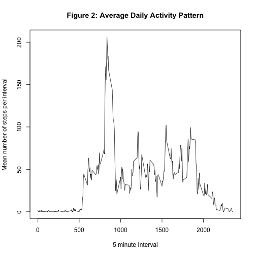
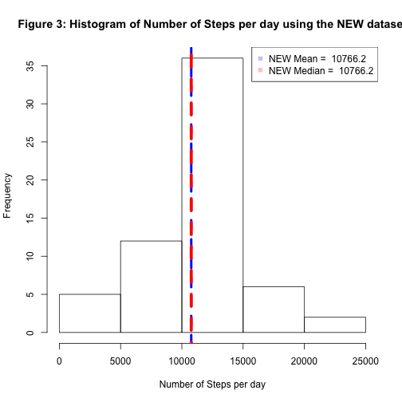
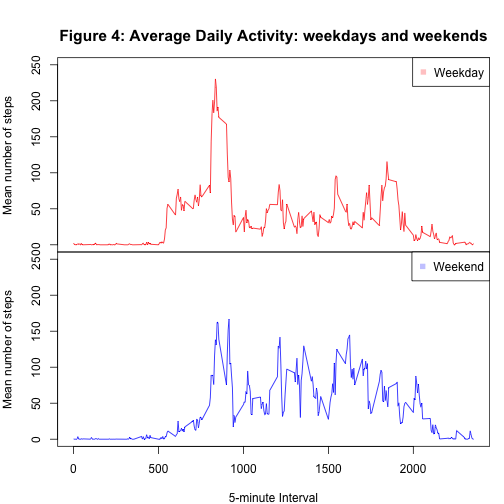

***Abstract***

As part of the Coursera "Reproducible Research Course" (JHU) this assignment makes use of data from a personal activity monitoring device in order to practice using R markdown and knit. Briefly, the assignment consists of retrieving and cleaning the data, together with some exploratory data analysis that allowed to answer a series of specific questions about this dataset. The results are presented in this HTML report, written in R markdown.

**Getting and Cleaning the Data**

For this assignment we make use of data from a personal activity monitoring device. This device collects data at 5 minute intervals through out the day. The data consists of two months of data from an anonymous individual collected during the months of October and November, 2012 and include the number of steps taken in 5 minute intervals each day.

The data set includes the following variables:

- steps: Number of steps taking in a 5-minute interval (missing values are coded as NA).

- date: The date on which the measurement was taken in YYYY-MM-DD format.

- interval: Identifier for the 5-minute interval in which measurement was taken.

So, we started by reading the data from the comma-separated file, and clean it from all entries with missing values (NE) for the number of steps:


```r
data <- read.csv("activity.csv")
cleandata <- data[complete.cases(data$steps),]
```

**Answering the assignment questions**

**Question 1: What is mean total number of steps taken per day?**

Ignoring the NA values in the dataset, we estimate median and mean number of steps per day in this sample. Also, we present an histogram of the number of steps per day:


```r
sum_steps_pd <- tapply(cleandata$steps, cleandata$date, sum)
mean_pd <- mean(sum_steps_pd, na.rm=T) #Ignoring dates with no data
median_pd <- median(sum_steps_pd, na.rm=T) #Ignoring dates with no data
mean_pd
```

```
## [1] 10766.19
```

```r
median_pd
```

```
## [1] 10765
```

```r
#Histogram plot
hist(sum_steps_pd, xlab ="Number of Steps per day", main = 
             "Figure 1: Histogram of Number of Steps per day")
lines(c(mean_pd, mean_pd), c(-500, 500), col="blue", lw=4, type="l", lty=2)
lines(c(median_pd, median_pd), c(-500, 500), col="red", lw=5, type="l", lty=2)
legend("topright", pch=c(15,15), col=c(rgb(0,0,1,1/4), rgb(1,0,0,1/4)), 
       legend=c(paste("Mean = ", round(mean_pd, digits=1)), 
                paste("Median = ", round(median_pd, digits=1))))
```

 

**Question 2: What is the average daily activity pattern?**

We simply average, for each day, the number of steps in each 5 minute interval and plot it


```r
mean_steps_pint <- tapply(cleandata$steps, cleandata$interval, mean)

# Figure of mean daily activity pattern
plot(levels(as.factor(cleandata$interval)), mean_steps_pint, type="l", 
     xlab="5 minute Interval", ylab="Mean number of steps per interval",
        main="Figure 2: Average Daily Activity Pattern")
```

 

```r
# 5-minute interval with the larger mean number of steps
mymax_step <- max(mean_steps_pint)
mymax_interv <- levels(as.factor(cleandata$interval))[mean_steps_pint == mymax_step]
```

According to Figure 2, the 5-minute interval with the larger mean number of steps is number 835 with 206.17 mean steps.


**Question 3: Inputing Missing values**

Splitting in sub-questions:

**Q3.1: Calculate and report the total number of missing values in the dataset**

We just use the original dataset and look for NA values in the 'step' column

```r
dataNA <- data[!complete.cases(data$steps),]
numNA <- nrow(dataNA)
```

The total number of entries (intervals) with missing values is ``2304``.


**Q3.2: Devise a strategy for filling in all of the missing values in the dataset and**

**Q3.3: Create a new dataset that is equal to the original dataset but with the missing data filled in.**

We decided to use a simple approach to address this point. Each missing value of 'steps' was replaced by the mean number of steps across all the days in the dataset for that specific missing interval. The new dataset is called 'dataNEW'.


```r
dataNEW <- data

# Loop in 'the NA entries found above in 'data' elements
for (i in 1:nrow(dataNEW)) {
        if (complete.cases(dataNEW[i,1]) == "FALSE") { 
                
                # Logical vector pointing the location of the right interval number
                # in the mean daily activity array calculated above.
                loc <- levels(as.factor(cleandata$interval)) == dataNEW[i,3]
                
                # We replace the missing value for that day interval by the mean 
                # number of steps for that interval along all the other days (with valid entries).
                dataNEW[i,1] <- mean_steps_pint[loc]
        }
}
```

**Q3.4: Make a histogram of the total number of steps taken each day and Calculate and report the mean and median total number of steps taken per day. Do these values differ from the estimates from the first part of the assignment? What is the impact of imputing missing data on the estimates of the total daily number of steps?**

So, having replaced the missing number of steps in the dataset by mens, we re-calculate the histogram of the number of steps per day and its median and mean.


```r
sumNEW_steps_pd <- tapply(dataNEW$steps, dataNEW$date, sum)
meanNEW_pd <- mean(sumNEW_steps_pd) 
medianNEW_pd <- median(sumNEW_steps_pd) 
meanNEW_pd
```

```
## [1] 10766.19
```

```r
medianNEW_pd
```

```
## [1] 10766.19
```

```r
#Histogram plot
hist(sumNEW_steps_pd, xlab ="Number of Steps per day", main = 
             "Figure 3: Histogram of Number of Steps per day using the NEW dataset")
lines(c(meanNEW_pd, meanNEW_pd), c(-500, 500), col="blue", lw=4, type="l", lty=2)
lines(c(medianNEW_pd, medianNEW_pd), c(-500, 500), col="red", lw=5, type="l", lty=2)
legend("topright", pch=c(15,15), col=c(rgb(0,0,1,1/4), rgb(1,0,0,1/4)), 
       legend=c(paste("NEW Mean = ", round(meanNEW_pd, digits=1)), 
                paste("NEW Median = ", round(medianNEW_pd, digits=1))))
```

 

As we see, now the median and mean of steps per day have an identical value of 1.07662 &times; 10<sup>4</sup>. In turn, this value is also identical to the mean found in Figure 1 where we just ignored the intervals with undefined (NA) number of steps. Also, the new median is just slightly higer (+1.2 steps) than the previously calculated one. Therefore, we conclude that for this dataset imputing missing data values has a negligible effect in our calculations and summaries of the data.


**Question 4: Are there differences in activity patterns between weekdays and weekends?**

As we have shown above, imputing missing data produces just a negligable bias in our calculations and data summary representations. Therefore in here we will keep using over newly generated 'dataNEW' set (i.g., dataset where we have imputed missing data values using means).

We start by creating a new factor variable that tell us if a given date was a weekday or weekend day:


```r
MtoS <- weekdays(as.Date(as.character(dataNEW$date))) #Days of the week
dayofweek <- MtoS
flg_wday <- MtoS != "Saturday" & MtoS != "Sunday"
dayofweek[flg_wday] <- "weekday" ; dayofweek[!flg_wday] <- "weekend" # New variable
dataNEW$dayofweek <- dayofweek # ...that we include as new column in dataframe
```

Now we make new daily activity pattern plots, separating weekdays and weekend days


```r
mean_steps_dayofweek <- tapply(dataNEW$steps, list(dataNEW$interval,dataNEW$dayofweek), mean)

# Figure of mean daily activity pattern split between weekdays and weekend days.
par(mfrow=c(2,1), mar=c(0,0,0,0), oma=c(4,4,4,1), xpd=NA)
plot(levels(as.factor(dataNEW$interval)), mean_steps_dayofweek[,1], type="l", 
     ylab="Mean number of steps", xlab="", xaxt='n', ylim=c(0,250), col="red")
legend("topright", pch=15, col=rgb(1,0,0,1/4), legend="Weekday")

plot(levels(as.factor(dataNEW$interval)), mean_steps_dayofweek[,2], type="l",
     ylab="Mean number of steps", xlab="5-minute Interval", ylim=c(0,250), col="blue")
legend("topright", pch=15, col=rgb(0,0,1,1/4), legend="Weekend")

mtext("Figure 4: Average Daily Activity: weekdays and weekends", side=3, line=1, outer=TRUE, cex=1.3, font=2)
```

 

From Figure 4 the differences in daily activity pattern between weekdays and weekends are obvious. For example, during weekends the activity is more evenly distributed during the day, while during week days the subject is more active in the earlier hours. 
